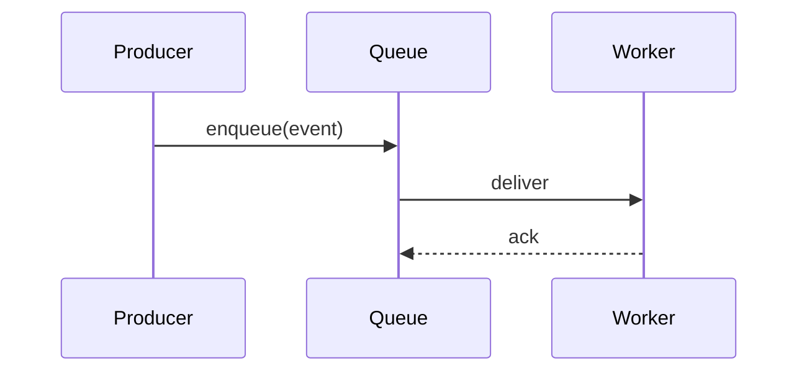

# Queue spec

## Mermaid

```mermaid
sequenceDiagram
  Producer->>Queue: enqueue(event)
  Queue->>Worker: deliver
  Worker-->>Queue: ack
```

## Images

## Footnote-ish text

Latency targets are in the appendix[^1].

[^1]: p95 < 200 ms, p99 < 500 ms.
